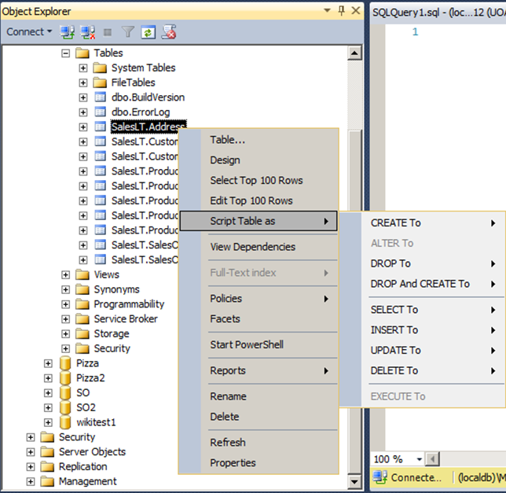

# SQL Server Management Studio (SSMS)

SQL Server is a DBMS which uses the client-server model. To use a
database management system (DBMS) like SQL Server, two components are
needed:

1.  A server. In our case, called "SQL Server". In this course we use
    the "SQL Server LocalDB" edition, and

2.  A client. In our case, called "SQL Server Management Studio" (SSMS).

## Client

SSMS is a DBMS client for SQL Server. It allows a user to 1) connect to
a server, 2) issue commands for a server to perform, and 3) see the
result of the command. Commands are issued as Structured Query Language
(SQL) statements.

SQL Server offers features beyond just being a DBMS, however, we will
only use SQL Server's database engine in this course. Other SQL Server
features are Analysis Server (for business intelligence activities) and
Reporting Server (for reporting activities).

## Server connection


The server name takes the format: hostNameserverInstanceName. The
server name is case-insensitive (ala Windows naming). "hostName" refers
to the server computer's address, usually an IP address or domain name.
Most servers will run multiple instances, meaning one server can host
multiple environments. Typing in "hostNameserverInstanceName" as the
server name will instruct SSMS to look for an instance named
"instanceName" on the computer with the name "hostName".

The default LocalDB host name and instance name is:
(LocalDB)MSSQLLocalDB

The brackets and backslash are important. (LocalDB) is a special name
that tells SSMS to look for a LocalDB service on the current computer,
and MSSQLLocalDB is the name of the default instance created by LocalDB.

MSSQLLocalDB is actually LocalDB's "automatic instance": it creates and
runs itself whenever you try to connect to it (which is great for simple
uses of SQL Server like we need in this course).

Windows Authentication allows the current logged-in user to log in using
their Windows login details. This is set up by default when using
LocalDB. The current user has full administrative permissions on the
LocalDB instance.

LocalDB 2016 documentation:
<https://docs.microsoft.com/en-us/sql/database-engine/configure-windows/sql-server-2016-express-localdb>

## SSMS layout

Object explorer on the left (you can hide (unpin) this). Open files as
tabs across the top.


The database name shown on the top left dropdown box shows the database
which the open file is connected to. Commands which are executed are
sent to this connected-to database.

Query results and command output are shown at the bottom of each open
file (where the command was issued). "Results to grid" is the default
output format.


## Features

The "database diagrams" feature allows you to view and create database
diagrams.


Virtually any action that is performed in SSMS is achieved by generating
SQL on the user's behalf and sending it to the server to execute. SSMS
allows you to see the SQL command, i.e. allows script generation.




## Commands

There are different types of commands:

  - Data Control Language (DCL): commands to set user permissions for
    objects.

  - Data Definition Language (DDL): commands to create and alter server
    objects: tables, columns, schemas (and views, triggers, functions,
    stored procedures, and more).

  - Data Manipulation Language (DML): commands to CRUD data in server
    objects (typically tables).
    
      - Create = [INSERT](#insert)
    
      - Read = [SELECT](#select)
    
      - Update = [UPDATE](#update)
    
      - Delete = [DELETE](#delete)
    
      - DML reference:
        <https://docs.microsoft.com/en-us/sql/t-sql/queries/queries>

We will spend most of our time learning DML basics, and little time on
[DDL basics](#_TABLE_DDL_(CREATE,).

## Objects

Manipulable "things" in SQL Server are called objects. The objects we
will use with explicit reference are tables, columns, constraints,
schemas, functions, and diagrams.

The objects you are likely to use "behind the scenes" are logins, users,
data types, triggers, and views.

When you connect to LocalDB you do so as an administrator so you can
view (read) and modify (write) any object as you please. In a production
DBMS, user access is tightly controlled for security and risk management
reasons.

# SQL Server data types

To enforce the integrity of data, values stored in SQL Server and most
DBMS are of a data type. Even though there are standards, types should
be understood to be specific to a DBMS. Common types we will use are in
the table below. The full list is available here:
<https://docs.microsoft.com/en-us/sql/t-sql/data-types/data-types-transact-sql>

<table>
<thead>
<tr class="header">
<th>Domain</th>
<th>SQL Server type</th>
<th>Meaning</th>
</tr>
</thead>
<tbody>
<tr class="odd">
<td>Number</td>
<td>INT</td>
<td><p>Integers. Commonly used for IDs.</p>
<p>BIGINT, SMALLINT, TINYINT are variations which have a different numeric ranges.</p>
<p>BIT only allows values of 1 (one) or 0 (zero) and is commonly used for true-false or yes-no values.</p>
<p><a href="https://docs.microsoft.com/en-nz/sql/t-sql/data-types/int-bigint-smallint-and-tinyint-transact-sql">https://docs.microsoft.com/en-nz/sql/t-sql/data-types/int-bigint-smallint-and-tinyint-transact-sql</a></p></td>
</tr>
<tr class="even">
<td></td>
<td>NUMERIC(p,s)</td>
<td><p>Numbers, where p is the total number of digits, and s is digits after the decimal point.</p>
<p>DECIMAL and DEC are synonyms.</p></td>
</tr>
<tr class="odd">
<td></td>
<td>MONEY</td>
<td>A special type of number to handle dollar values to 4dp.</td>
</tr>
<tr class="even">
<td>Text</td>
<td>VARCHAR(n)</td>
<td><p>A "<code>var</strong>iable-length <strong>char</strong>acter string" of up to n characters.</p>
<p>When entering text, use single quotes, e.g.</p>
<code>SELECT 'hello', 'HELLO'</code></td>
</tr>
<tr class="odd">
<td></td>
<td>NVARCHAR(n)</td>
<td>Same as above but more characters are supported (<a href="https://msdn.microsoft.com/en-us/library/ms186939.aspx">encoded using Unicode</a>). The N stands for "National", to mean international support.</td>
</tr>
<tr class="even">
<td></td>
<td>The case sensitivity of text data in SQL Server (and other DBMS) is determined by default settings which can be overridden by the DBA. <strong>All data sets provided in this course are case sensitive</strong>.</td>
<td></td>
</tr>
<tr class="odd">
<td>Date and time</td>
<td><p>DATETIME</p>
<p>(Also DATE for date only, and TIME for time only.)</p></td>
<td><p>YYYY-MM-DD hh:mm:ss</p>
<p>(<a href="https://docs.microsoft.com/en-us/sql/t-sql/data-types/datetime-transact-sql">Other formats</a> will also work.)</p>
<p>Note: Microsoft recommends DATETIME2 for new data sets since it has a larger range. AWLT was created before DATETIME2 was the standard, so we will use DATETIME in AWLT.</p>
<p>When entering datetimes, use single quotes, e.g.</p>
<code>SELECT '2019-01-01 12:45'</code>
<p>Omitted time values default to 0 (zero). E.g. the above value would result in 2017-01-01 12:45:00</p></td>
</tr>
<tr class="even">
<td>Others in AWLT</td>
<td><a href="https://docs.microsoft.com/en-us/sql/t-sql/data-types/uniqueidentifier-transact-sql"><span class="underline">UNIQUEIDENTIFIER</span></a>, <a href="https://docs.microsoft.com/en-us/sql/t-sql/data-types/binary-and-varbinary-transact-sql">VARBINARY</a>, <a href="https://docs.microsoft.com/en-us/sql/t-sql/xml/xml-transact-sql">XML</a></td>
<td></td>
</tr>
</tbody>
</table>

# SELECT

SELECT reference:
<https://docs.microsoft.com/en-us/sql/t-sql/queries/select-transact-sql>

## SELECT: Simplified syntax for one table

"Retrieves rows from the database and enables the selection of one or
many rows or columns from one or many tables in SQL Server. The full
syntax of the SELECT statement is complex, but the main clauses can be
summarized as:"

```sql
[ WITH { [ XMLNAMESPACES ,] [ <common_table_expression> ] } ]

SELECT select_list [ INTO new_table ]

[ FROM table_source ]

[ WHERE search_condition ]

[ GROUP BY group_by_expression ]

[ HAVING search_condition ]

[ ORDER BY order_expression [ ASC | DESC ] ]
```
The above text is an example of a grammar (syntax) specification. SQL,
being a formal language, has rules which must be adhered to. It is
analogous to saying the English language consists of rules which
determine whether a sentence is grammatically valid.

This describes the conventions used to express the syntax of SQL
Server's SQL:
<https://docs.microsoft.com/en-us/sql/t-sql/language-elements/transact-sql-syntax-conventions-transact-sql>

<table>
<thead>
<tr class="header">
<th>Key word (clause)</th>
<th>Meaning</th>
</tr>
</thead>
<tbody>
<tr class="odd">
<td>SELECT</td>
<td><p>SELECT statements are used to retrieve data. No changes are made to the data in the database.</p>
<p>The select_list states the value to retrieve. The list may be column names or expressions.</p>
<p>A select_list affects the number of columns retrieved only (not rows).</p></td>
</tr>
<tr class="even">
<td>FROM</td>
<td><p>Name of tables the data is to be retrieved from.</p>
<p>Tables are often database– or schema-qualified in the format:</p>
<p>databaseName.schemaName.tableName</p>
<p>Where the database or schema names are omitted, the default names are used.</p>
<ul>
<li><p>Default database name is the currently active one.</p></li>
<li><p>Default schema name is defined by each database ("dbo" by default).</p></li>
</ul></td>
</tr>
<tr class="odd">
<td>WHERE</td>
<td><p>Specifies a search_condition, and only data (rows) which meet the condition are retrieved.</p>
<p>A WHERE clause affects number of rows selected only; it does not affect the values selected.</p></td>
</tr>
<tr class="even">
<td><p>ORDER BY col</p>
<p>ORDER BY expr, ...</p>
<p>ASC or DESC</p></td>
<td><p>Sort the retrieved rows in this order. Multiple column names or expressions may be provided.</p>
<p>A column name will cause the values of that column to determine the row order.</p>
<p>An expression will provide the value to determine the row order.</p>
<p>The default sort ordering is ascending (ASC). DESC can be written to use a descending sort ordering.</p>
<p>Where multiple columns / expressions are provided, rows will be sorted by the first column / expression and if there are rows with the same value, those rows will be sorted by the next column / expression provided.</p>
<p>An ORDER BY clause affects how the data is displayed only; it does not affect the number of columns, number of rows, or any values returned.</p></td>
</tr>
</tbody>
</table>


Examples:
<https://docs.microsoft.com/en-us/sql/t-sql/queries/select-examples-transact-sql>

```sql
SELECT CustomerID
FROM AdventureWorksLT2012.SalesLT.Customer

SELECT CustomerID, NameStyle, Title, FirstName, LastName, CompanyName
FROM SalesLT.Customer

SELECT * -- avoid using this
FROM SalesLT.Customer

SELECT CustomerID AS id, CompanyName AS [company Name]
FROM SalesLT.Customer

SELECT DISTINCT Title
FROM SalesLT.Customer
```


```sql
SELECT TOP 5
  SalesOrderID,
  ProductID,
  OrderQty * UnitPrice AS NonDiscountSales,
  (OrderQty * UnitPrice) * UnitPriceDiscount AS Discounts
FROM SalesLT.SalesOrderDetail
ORDER BY Discounts ASC
```

### Simple SELECT exercises

1)  Retrieve data from any 1 column from the SalesOrderDetail table.

2)  Show any 3 columns from the Customer table. And then
    
    1.  Sort (ascendingly) the results by values of the first column.
    
    2.  Sort (descendingly) the results by values of the first column.
    
    3.  Sort (ascendingly) the results by values of the second column.
    
    4.  Sort (ascendingly) the results by values of a column not
        selected.

3)  Show the second, third, and fourth columns from the Address table.

4)  List all customer phone numbers. What datatypes are these numbers?

5)  Show all unique postal codes. What datatypes are these post codes?

6)  Show all addresses in alphabetical order by country. If multiple
    addresses have the country, then order those alphabetically by their
    state / province. If multiple addresses have the same value for
    country and state / province, then order those alphabetically by
    their city.

7)  Select a column with a VARBINARY type.

8)  Select a column with a UNIQUEIDENTIFIER type.

For all queries above, all available rows from the selected table are
returned since there is no <code>WHERE</code> clause.

## SELECT: Operators

<table>
<thead>
<tr class="header">
<th>Operator</th>
<th>Meaning</th>
</tr>
</thead>
<tbody>
<tr class="odd">
<td>+ (plus)</td>
<td>Add two numbers</td>
</tr>
<tr class="even">
<td>+ (plus)</td>
<td>Concatenate two strings</td>
</tr>
<tr class="odd">
<td><p>- (dash)</p>
<p>/ (forward slash)</p>
<p>* (asterisk)</p></td>
<td><p>Subtract two numbers</p>
<p>Divide two numbers</p>
<p>Multiply two numbers</p></td>
</tr>
</tbody>
</table>

```sql
SELECT
  CustomerID,
  CustomerID - 100,
  CustomerID + CustomerID,
  Title + FirstName + MiddleName + LastName + Suffix,
  'Hello ' + Title + ' ' + LastName,
  ModifiedDate,
  ModifiedDate + 1
FROM SalesLT.Customer
ORDER BY LastName
```
Note that dates should manipulated using [date
functions](#select-scalar-functions) rather than arithmetic operators.

### Operator exercises

1)  For each sales order, show that the sum of its subtotal, tax amount,
    and freight amount equals its total due amount.

2)  What is the amount of tax, as a percentage, applied to each sales
    order? (What percentage of the SubTotal is the TaxAmt?)

3)  For each customer, show their name in the format:  
    <code>Lastname, Firstname.</code>
    Show the comma, space, and full stop characters.

    Considering you know the datatype of the Address.PostalCode column,
    answer the following:

4)  What is the result of <code>PostalCode + 'X'</code> for all postal codes?

5)  What is the result of <code>PostalCode + 'X'</code> for numeric codes? E.g.
    Addresses with Id 9, 11, and 25 all have numeric post codes. The
    query below will only show addresses with numeric post codes.

```sql
SELECT AddressID, PostalCode
FROM SalesLT.[Address]
WHERE PostalCode NOT LIKE '%[A-Za-z-]%' ESCAPE ''
```
6)  What is the result of <code>1 + PostalCode</code> for numeric codes?

7)  What is the result of <code>1 + PostalCode</code> for non-numeric codes?

8)  How would you append or prepend (concatenate) the number 1 to a post
    code?

9)  List all sales order details in descending order of their line total
    excluding discounts.
    
      - View the LineTotal column's metadata to find out how it is
        currently calculated.

For all queries above without a <code>WHERE</code> clause, all rows from the selected
table are returned.

## SELECT: Operators used in WHERE 

Comparison operators:
<https://docs.microsoft.com/en-us/sql/t-sql/language-elements/comparison-operators-transact-sql>

Logical operators:
<https://docs.microsoft.com/en-us/sql/t-sql/language-elements/logical-operators-transact-sql>

Precedence:
<https://docs.microsoft.com/en-us/sql/t-sql/language-elements/operator-precedence-transact-sql>

(BEDMAS then comparison operators then AND then OR)

The following operators are considered "infix binary operators" as they
sit in the middle of, and act upon, two surrounding operands.

<table>
<thead>
<tr class="header">
<th>Operator</th>
<th>Meaning</th>
</tr>
</thead>
<tbody>
<tr class="odd">
<td>=</td>
<td>Left equals right.</td>
</tr>
<tr class="even">
<td>&lt;&gt;</td>
<td>Left does not equal right.</td>
</tr>
<tr class="odd">
<td>&gt;</td>
<td>Left strictly greater than right.</td>
</tr>
<tr class="even">
<td>&gt;=</td>
<td>Left greater than or equal to right.</td>
</tr>
<tr class="odd">
<td><p>IS NULL</p>
<p>IS NOT NULL</p></td>
<td><p>Left is a null value.</p>
<p>Left is not a null value.</p>
<p>SQL Server has <a href="https://en.wikipedia.org/wiki/Null_(SQL)#Comparisons_with_NULL_and_the_three-valued_logic_.283VL.29">3-value logic</a>: true, false, and unknown.</p>
<p>Null does not equal anything, but is the same as null. Comparisons with NULL usually result in unknown.</p>
<code>SELECT 'Where clause is true'<br/>
WHERE NULL IS NULL</code></td>
</tr>
<tr class="even">
<td><p>BETWEEN n AND m</p>
<p>NOT BETWEEN n AND m</p></td>
<td><p>Left between n and m (inclusive).</p>
<p>Left is not between n and m (inclusive).</p></td>
</tr>
<tr class="odd">
<td><p>IN (e<sub>1</sub>, e<sub>2</sub>, ..., e<sub>n</sub>)</p>
<p>NOT IN (e<sub>1</sub>, e<sub>2</sub>, ..., e<sub>n</sub>)</p></td>
<td><p>Left in the list of values.</p>
<p>Left is not in the list of values.</p></td>
</tr>
<tr class="even">
<td><p>LIKE <em>pattern</em></p>
<p>NOT LIKE <em>pattern</em></p></td>
<td><p>Left match a pattern. A pattern is a string with wildcards.</p>
<p>Left does not match a pattern.</p>
<p><code>_</code> represents any single char</p>
<p><code>%</code> represents any number of any chars</p>
<p><code>[abc]</code> represents either 'a' or 'b' or 'c'</p>
<p><a href="https://msdn.microsoft.com/en-us/library/ms179859.aspx">See</a> <a href="https://docs.microsoft.com/en-us/sql/t-sql/language-elements/like-transact-sql"><span class="underline">https://docs.microsoft.com/en-us/sql/t-sql/language-elements/like-transact-sql</span></a></p></td>
</tr>
<tr class="odd">
<td>AND</td>
<td><p>True if left expression is true and right expression is true.</p>
<p>True means not false and not null and not unknown.</p>
<p>Always use brackets for clarity.</p></td>
</tr>
<tr class="even">
<td>OR</td>
<td><p>True if at least one of left expression or right expression is true.</p>
<p>Always use brackets for clarity.</p></td>
</tr>
</tbody>
</table>


```sql
SELECT
  CustomerID,
  FirstName
FROM SalesLT.Customer
WHERE FirstName = 'Ron'

SELECT
  CustomerID,
  FirstName
FROM SalesLT.Customer
WHERE CustomerID >= 29847

SELECT
  CustomerID,
  FirstName,
  LastName,
  ModifiedDate
FROM SalesLT.Customer
WHERE ModifiedDate < '2005-08-01'

SELECT
  CustomerID,
  Title + FirstName + MiddleName + LastName + Suffix
FROM SalesLT.Customer
WHERE Title IS NOT NULL --AND Suffix IS NOT NULL

SELECT
  CustomerID,
  FirstName
FROM SalesLT.Customer
WHERE FirstName LIKE '_on%' --'_o[bn]'

SELECT CustomerID
FROM SalesLT.Customer
WHERE (CustomerID = 1) OR (CustomerID > 30000) --brackets are not necessary here

SELECT *
FROM SalesLT.Customer
WHERE (CustomerID = 1 OR CustomerID > 30000) --brackets are necessary here
AND MiddleName IS NOT NULL

SELECT *
FROM SalesLT.Customer
WHERE CustomerID IN (100, 200, 300, 400)

SELECT *
FROM SalesLT.Customer
WHERE CustomerID IN (
  SELECT CustomerID
  FROM SalesLT.SalesOrderHeader --this is a sub-query
)
```
### WHERE exercises

From the customer table, select:

1)  Exactly 3 columns and 1 row.

2)  Exactly 1 column and 3 rows.

3)  Data for all customers without titles and middle names and suffixes
    (without all 3).

4)  Data for all customers who don't have a title or a middle name or a
    suffix (without at least 1).

5)  Data for all customers, i.e. show all rows.

From the product table:

6)  Select all products that weigh over 1kg. Assume weight values to be
    in grams.

7)  Find the product number of the lightest pedal. All pedals contain
    the word "Pedal" in their name. Do this by sorting your results so
    the lightest pedal is listed first.

8)  Select all products without a value in the Colour column.

9)  Select all products which are not white (including those without a
    colour).

10) Select all products categorised as "Bikes" which are no longer for
    sale. Products no longer for sale have an end date or a discontinued
    date in the past.

11) Of the products found in j., how many different product models are
    there?

12) Write a query to help you check that every product whose name ends
    in uppercase "S" is assigned the correct size value.

## SELECT: Scalar functions

Scalar functions transform input values into a single output value.
Remember y = f(x) ? And z = f(x, y)? Some useful functions are listed
below.

Scalar string functions (manipulate strings):
```sql
SELECT TOP 10
  UPPER(FirstName),
  LOWER(FirstName),
  FirstName
FROM SalesLT.Customer

SELECT Firstname
FROM SalesLT.Customer
WHERE LOWER(FirstName) LIKE '%ron%'

SELECT
  sub.[is] AS [original text],
  LEN([is]) AS [length],
  SUBSTRING([is], 7, 10) AS [substring example],
  REPLACE([is], 'an', 'X') AS [replace example],
  UPPER(SUBSTRING([is], 7, 10)) AS [nested example],
  REPLACE(LOWER([is]), 'AN', 'x') AS [nested example]
FROM (SELECT 'BUSAN 201: Data Management' AS [is]) sub --this is a sub-query
```
Scalar mathematical functions:

```sql
SELECT TOP 20 ProductID
  ,Name
  ,Size
  ,Weight
  ,ROUND(Weight, 1)
FROM SalesLT.Product
```
Scalar date functions allow manipulation of dates, times, and datetimes:
```sql
SELECT GETDATE()

SELECT YEAR('2018-12-31')

SELECT YEAR(GETDATE())

SELECT SalesOrderID
  ,OrderDate
  ,DueDate
  ,ShipDate
FROM SalesLT.SalesOrderHeader
WHERE GETDATE() <= DueDate OR GETDATE() <= ShipDate
```
`CAST` is necessary to convert a value from one datatype to another:
<https://docs.microsoft.com/en-us/sql/t-sql/functions/cast-and-convert-transact-sql#BKMK_examples>
```sql
SELECT FirstName + ' ' + LastName + '''s customer ID is ' + CAST(CustomerID AS VARCHAR(10))
FROM SalesLT.Customer
```
`ISNULL` is used to handle NULL values:
```sql
SELECT
  Title + ' ' + LastName + ' ' + ISNULL(Suffix, ''),
  Title + ' ' + LastName + ' ' + Suffix,
  CustomerID
FROM SalesLT.Customer
WHERE CustomerID < 17
ORDER BY CustomerID
```
`COALESCE` acts like a super `ISNULL`:
```sql
SELECT Name
  ,COALESCE(CAST(Size AS NVARCHAR(10)), CAST(Weight AS NVARCHAR(10)), Color, '') AS description
FROM SalesLT.Product
```
### Function exercises 

1)  Show all customers whose first names contains more than 10
    characters.

2)  Show all customers whose full name—first and last names
    only—contains more than 20 characters.

3)  Show all products which contain the word "bike" in any
    capitalisation format in their name. The word could be "Bike",
    "bikE", or "bIKe", etc.

4)  Write a select query which returns for each sales order: its order
    number, and the number of days ago the order was due. Use the
    `DATEDIFF()` function
    <https://docs.microsoft.com/en-us/sql/t-sql/functions/datediff-transact-sql>

5)  Write a select query that returns the same data as d. but formats
    the result for each order as a single string. E.g.
    
    

6)  Write a query to select:
    
      - ProductID, ProductNumber, Name, Size, Weight for Products that
        are still for sale and have a Size but that size is not "M".
        
          - Columns: ProductID, ProductNumber, Name, Size, Weight
        
          - Rows: Products that are still for sale AND have a size AND
            the size is not equal to "M".
    
      - Change your query so that if a product does not have a size, it
        shows "Unknown".
        
          - Consider does the function appear in `SELECT` or `WHERE`?
    
      - Change your query so that if a product does not have a weight,
        it shows 0 (zero).
        
          - Consider does the function appear in `SELECT` or `WHERE`?
    
      - Change your query so that each product's weight is in the
        following format: "n grams", where n is the weight value.
        
          - Consider does the function appear in `SELECT` or `WHERE`?

7)  Show all customers whose full name—including their title, middle
    names, and suffix—contains more than 20 characters.

8)  As g) above, but do not count full stops as characters.

9)  As g) above, but do not count full stops or spaces as characters.

## SELECT: Syntax for multiple tables
```sql
SELECT ...
FROM schemaT1.tableT1 [AS] T1alias
  [ INNER | LEFT OUTER | RIGHT OUTER ] JOIN schemaT2.tableT2 [AS] T2_alias ON join_condition_1
  [ INNER | LEFT OUTER | RIGHT OUTER ] JOIN schemaT3.tableT3 [AS] T3_alias ON join_condition_2
  [ INNER | LEFT OUTER | RIGHT OUTER ] JOIN schemaT(n).tableT(n) [AS] T(n)_alias ON join_condition_(n)
[ WHERE ]
[ GROUP BY ]
[ HAVING ]
[ ORDER BY ]
```


  

```sql
SELECT c.*, ca.*, a.*
FROM SalesLT.Customer c
  INNER JOIN SalesLT.CustomerAddress ca ON c.CustomerID = ca.CustomerID
  INNER JOIN SalesLT.[Address] a ON ca.AddressID = a.AddressID

SELECT c.*, ca.*
FROM SalesLT.Customer c
  LEFT OUTER JOIN SalesLT.CustomerAddress ca ON c.CustomerID = ca.CustomerID

SELECT *
FROM SalesLT.ProductCategory pc
  JOIN SalesLT.ProductCategory parentpc ON pc.ParentProductCategoryID = parentpc.ProductCategoryID
```
Joins typically follow the pattern: table1.PK = table2.FK

Where composite keys exist, the pattern is:
```sql 
  table1.PK(a) = table2.FK(a)
  AND table1.PK(b) = table2.FK(b)
  AND table1.PK(c) = table2.FK(c)
```
(PK(a), PK(b), and PK(c) form the primary key of table1)

The words `INNER` and `OUTER` are optional.

`JOIN` is a shortcut for `INNER JOIN`,

`LEFT JOIN` is a shortcut for` LEFT OUTER JOIN`,

`RIGHT JOIN` is a shortcut for `RIGHT OUTER JOIN`, and

`FULL JOIN` is a shortcut for `FULL OUTER JOIN` (both left outer and
right outer).

<http://www.w3schools.com/sql/sql_join.asp> contains a simple tutorial
on joins.

Everything that you already know about `SELECT` statements still applies.
The statement below is a valid `SELECT` statement with: a
column/expression alias, functions, string concatenation, two inner
joins, table aliases, a `WHERE` clause, `AND` and `IS` and `<>` operators, and
an `ORDER BY` clause.
```sql
SELECT c.CustomerID, CompanyName, EmailAddress, AddressType, AddressLine1 + ', ' + City + ', ' + UPPER(PostalCode) AS [Address for print]
FROM SalesLT.Customer c
  INNER JOIN SalesLT.CustomerAddress ca ON c.CustomerID = ca.CustomerID
  INNER JOIN SalesLT.[Address] a ON ca.AddressID = a.AddressID
WHERE LOWER(AddressType) <> 'main office'
  AND Suffix IS NULL
ORDER BY SUBSTRING(AddressLine1, CHARINDEX(' ', AddressLine1), 99) --StreetName
```
### JOIN exercises

Write queries which retrieve data from the following tables using inner
joins:

1)  SalesOrderHeader and SalesOrderDetail.

2)  SalesOrderDetail and Product.

3)  Customer and SalesOrderHeader.

4)  SalesOrderHeader and billing Address only.

5)  SalesOrderHeader and shipping Address only

6)  SalesOrderHeader and both billing and shipping Address.

7)  Customer, SalesOrderHeader, and billing Address.

8)  Customer, SalesOrderHeader, and shipping Address.

9)  Customer, SalesOrderHeader, and Customer's "Main Office" Address
    only.

Write a query to show:

10) For each sales order, its: customer's name, customer's main office
    address line 1, billing address line 1, shipping address line 1.

11) All addresses and their assigned customer. If there is no customer
    assigned, show the word "NULL". Use an outer join.

12) <span id="addresses_not_assigned" class="anchor"></span>All
    addresses which are not assigned to a customer. Use an outer join.

13) Orders where the billing address city is different to the shipping
    address city.

14) Show orders where its billing and shipping addresses are different.
    Do not use a join.

15) Which products have been ordered by which customers. Show only ID
    numbers, and sort by ProductID E.g.
    
    


## SELECT: Aggregate functions (group functions)

Functions you have seen till now operated on a 'row-by-row' basis:
inputs and the resulting output are all in the same row. E.g.
```sql
SELECT TOP 10 LOWER(FirstName)
FROM [SalesLT].[Customer]
```
<https://docs.microsoft.com/en-us/sql/t-sql/functions/aggregate-functions-transact-sql>:
"Aggregate functions perform a calculation on a set of values [from
multiple rows] and return a single value. … [A]ggregate functions
ignore null values. Aggregate functions are frequently used with the
GROUP BY clause".

<table>
<thead>
<tr class="header">
<th>Function</th>
<th>Meaning</th>
</tr>
</thead>
<tbody>
<tr class="odd">
<td>MIN( expr )</td>
<td><p>Return the smallest value (determined by the datatype) for each group.</p>
<p><a href="https://docs.microsoft.com/en-us/sql/t-sql/functions/min-transact-sql">https://docs.microsoft.com/en-us/sql/t-sql/functions/min-transact-sql</a></p></td>
</tr>
<tr class="even">
<td>MAX( expr )</td>
<td><p>Return the largest value (determined by the datatype) for each group.</p>
<p><a href="https://docs.microsoft.com/en-us/sql/t-sql/functions/sum-transact-sql">https://docs.microsoft.com/en-us/sql/t-sql/functions/sum-transact-sql</a></p></td>
</tr>
<tr class="odd">
<td><p>SUM( expr )</p>
<p>SUM( DISTINCT expr )</p></td>
<td><p>Return the sum of all values for each group. Accepts numerical datatypes only; nulls are ignored.</p>
<p><a href="https://docs.microsoft.com/en-us/sql/t-sql/functions/sum-transact-sql">https://docs.microsoft.com/en-us/sql/t-sql/functions/sum-transact-sql</a></p></td>
</tr>
<tr class="even">
<td>AVG( expr )</td>
<td><p>Return the mean of all values for each group. Accepts numerical datatypes only; nulls are ignored.</p>
<p><a href="https://docs.microsoft.com/en-us/sql/t-sql/functions/avg-transact-sql">https://docs.microsoft.com/en-us/sql/t-sql/functions/avg-transact-sql</a></p></td>
</tr>
<tr class="odd">
<td><>COUNT( expr )</p>
<p>COUNT(*)</p>
<p>COUNT( DISTINCT expr )</p></td>
<td><p>Return the number of non-null values for each group.</p>
<p><code>COUNT(*)</code> includes duplicates and nulls—used for row counts.</p>
<p><code>COUNT( DISTINCT )</code> excludes duplicate values.</p>
<p><a href="https://docs.microsoft.com/en-us/sql/t-sql/functions/count-transact-sql">https://docs.microsoft.com/en-us/sql/t-sql/functions/count-transact-sql</a></p></td>
</tr>
</tbody>
</table>

If no `GROUP BY` clause is given, then all rows returned are treated as a
single group. It may help to consider these rules:

1.  `GROUP BY` can be translated to "for each unique value of".

2.  All data returned must either be used in an aggregate function, or
    included in the `GROUP BY` clause.

3.  The order of processing is: `FROM`, `WHERE`, `GROUP BY`. Therefore, joins
    are performed first, then rows are filtered, then groups are formed.
```sql
SELECT
   MIN(OrderQty) AS [fewest units ordered]
  ,MAX(OrderQty) AS [most units ordered]
  ,MIN(UnitPrice) AS [lowest unit price]
  ,MAX(UnitPrice) AS [highest unit price]
  ,MAX(ModifiedDate) AS [latest date]
FROM SalesLT.SalesOrderDetail

SELECT
   SUM([SubTotal])
  ,SUM([TaxAmt])
  ,SUM([Freight])
  ,SUM([TotalDue])
  ,AVG([TotalDue])
  ,COUNT(SalesOrderID)
FROM [SalesLT].[SalesOrderHeader]

SELECT
   ProductID
  ,COUNT(SalesOrderID)
  ,SUM(OrderQty)
  ,AVG(UnitPrice)
  ,SUM(LineTotal)
FROM SalesLT.SalesOrderDetail
GROUP BY ProductID --for each unique ProductID value after joins and
WHERE applied
ORDER BY ProductID

SELECT
   p.ProductID
  ,p.Name
  ,AVG(UnitPrice)
  ,p.ListPrice
FROM SalesLT.SalesOrderDetail sod
  JOIN SalesLT.Product p ON sod.ProductID = p.ProductID
  JOIN SalesLT.ProductCategory pc ON p.ProductCategoryID = pc.ProductCategoryID
WHERE LOWER(pc.Name) LIKE '%bike%'
GROUP BY p.ProductID, p.Name, p.ListPrice
ORDER BY p.ListPrice - AVG(UnitPrice) DESC
```
Everything that you already know about `SELECT` statements and joins still
apply.

### Aggregate function exercises

1)  If a `SELECT` statement uses an aggregate function without a `GROUP BY`
    clause, how many rows must it return?

2)  Write a query using `COUNT(*)` to find out how many customers are in
    the customer table.
    
      - Which column(s) could be counted to achieve a row count of the
        customer table?

3)  How many customers have middle names?

4)  How many customers have middle names and / or name suffixes?

5)  How many different city names are in the address table?

6)  How many different cities are in the address table? Cities with the
    same name but in different countries are considered different
    cities.

7)  Show all customer names and how many addresses they each have. List
    the customers with the most addresses first.

8)  For each country, show how many [addresses in that country are not
    assigned to a customer](#addresses_not_assigned).

9)  For each letter of the alphabet, show the number of first names in
    the customer table that begin with that letter. You may omit letters
    with a count of 0. Example output:


## SELECT: HAVING clause

A `HAVING` clause can be thought of as a condition (just like a `WHERE`
clause) that gets applied after the GROUP BY clause.

The order of processing is: `FROM`, `WHERE`, `GROUP BY`, `HAVING`. Therefore,
joins are performed first, then rows are filtered (before groups exist),
then groups are formed, then the `HAVING` clause is applied to the
now-grouped rows.

It is common to have an aggregate function in a `HAVING` clause because
conditions not involving groups can usually be done before the groups
are created (i.e. in the `WHERE` clause). This has the benefit of
processing less data at the group stage. E.g.
```sql
SELECT FirstName, COUNT(CustomerID) AS frequency
FROM SalesLT.Customer
WHERE LEN(FirstName) BETWEEN 5 AND 7 --this results in less "grouping effort"
GROUP BY FirstName
HAVING COUNT(CustomerID) > 7
AND LEN(FirstName) BETWEEN 5 AND 7 --this is now redundant
ORDER BY 1
```
### HAVING exercises

1)  Show the names of all customers who have more than one address.
    
      - You should group by CustomerID to distinguish each customer.

2)  How many products are there of each colour?
    
      - Add a `HAVING` clause to your query to only show groups with:
        
        1.  Product counts of 10
        
        2.  Product counts less than 10
        
        3.  An average product weight of at least 500
        
        4.  A maximal product weight less than 500

3)  Show the names of each category, and the number of products
    belonging to that category.
    
      - Add a `HAVING` clause to your query to only show groups with:

        1.  Product counts of 10

        2.  Product counts less than 10

        3.  An average product weight of at least 500

        4.  A maximal product weight less than 500

4)  Show the names of all categories, and the number of subcategories
    belonging to that category.
    
      - Add a `HAVING` clause to only show categories with no
        subcategories.

5)  Write a query to find duplicate addresses based on this logic: any
    addresses which have the same AddressLine1 and City and State /
    Province are considered the same address.

6)  Add meaningful `HAVING` clauses to the group queries from the
    <span class="underline">Aggregate function exercises.</span>

## SELECT: CASE expression

<https://docs.microsoft.com/en-us/sql/t-sql/language-elements/case-transact-sql>

There are two types of `CASE` expressions: "simple" and "searched". We
will only cover the searched type. Both achieve the same outcome; the
searched `CASE` expression is a superset of the simple. (The searched `CASE`
expression is also a superset of the [<span class="underline">`IIF`</span>
function](https://docs.microsoft.com/en-us/sql/t-sql/functions/logical-functions-iif-transact-sql).)

A `CASE` expression looks different to, and works differently to,
functions and other expressions and clauses we have seen until now. It
is a block of code, rather than a single line clause. The syntax of a
searched `CASE` expression is:
```sql
CASE
  WHEN Boolean_expression THEN result_expression [ ...n ]
  [ ELSE else_result_expression ]
END
```
E.g.
```sql
SELECT TOP 20
   ProductID
  ,Name
  ,CASE
      WHEN Size = 'S' THEN 'Small'
      WHEN Size = 'M' THEN 'Medium'
      WHEN Size LIKE '%L' THEN 'Biggish'
      --ELSE 'Not any of the above'
   END
  ,Size --included for comparison
FROM SalesLT.Product
```
A `CASE` expression is unique in that it can appear in the middle of other
expressions or clauses. It can look strange. E.g.
```sql
SELECT
   ProductID
  ,Name
  ,ListPrice --included for comparison
  ,ListPrice * CASE
                  WHEN Size = 'S' THEN 1
                  WHEN Size = 'M' THEN 2
                  WHEN Size LIKE '%L' THEN 3
                  ELSE 0
               END AS [modified price]
FROM SalesLT.Product
WHERE Size IS NOT NULL
ORDER BY CASE
            WHEN Name LIKE '%SML' THEN -1 * ProductID
            ELSE ProductID
         END ASC, ListPrice DESC
```
`CASE` expressions allow useful computation possibilities with SQL. Some
of the exercises attempt to showcase this.

### CASE exercises

1)  Modify the first example above to also check for NULL sizes. If a
    Product's size is null show 0 (zero) as its size.

2)  Classification of rows into derived groups:
    
    1.  Consider the situation where manager approval is required for
        sales orders with SubTotals of at least $10,000. Write a query
        with a `CASE` expression which shows, for each order, whether
        approval is needed. If approval is needed then show the number
        1, otherwise show 0 (zero).
    
    2.  Add to your query so it shows how many sales orders have been
        made which require approval and how many which do not. I.e.
        `GROUP BY` the value you added above. E.g.
        
        

3)  Conditional counts / sums:
    
    1.  For each sales order show how many units of products were sold
        on discount and how many were not. E.g.


## SELECT: Set operators

Set operators combine results from two or more queries into a single
result set.

Joins allowed us to take multiple data sources (tables) to "include more
columns"; set operators allows us to take multiple data sources to
"include more rows". SQL Server supports three set operators:

  - `UNION` (combine left and right),

  - `INTERSECT` (exists in both left and right), and

  - `EXCEPT` (exists in left but not in right).

Sets operated upon must have the same number of columns, and each
respective column must use the same (or a compatible) datatype. A set,
by definition, only contains distinct values. This is all based on [set
theory](https://en.wikipedia.org/wiki/Set_theory).

Set operators are used where rows come from differing sources and a join
is not possible or not efficient.

Web search engines use this type of logic too. For example, when
searching for resources—residing in multiple locations—which contain the
words "Auckland" and "University", an `INTERSECT` could be used: of all
the resources which matched "Auckland", we only want to include those
which also matched "University". This logically translates to:
```sql
SELECT ... FROM source_of_data WHERE -- matches Auckland
INTERSECT
SELECT ... FROM different_source_of_data WHERE -- matches University
```
Similarly, an "or" search would translate to UNION logic.

Examples:
```sql
--Compare with SELECT 'Mother', 'Father'
SELECT 'Mother' AS Name
UNION
SELECT 'Father'

SELECT
  'Child' AS CategoryType,
  Name
FROM SalesLT.ProductCategory
WHERE ParentProductCategoryID IS NOT NULL
UNION
SELECT
  'Parent',
  Name
FROM SalesLT.ProductCategory
WHERE ParentProductCategoryID IS NULL

SELECT DISTINCT FirstName
FROM SalesLT.Customer
WHERE Title IN ('Ms.', 'Sra.')
INTERSECT
SELECT DISTINCT FirstName
FROM SalesLT.Customer
WHERE Title IN ('Mr.', 'Sr.')

SELECT ProductID
FROM SalesLT.SalesOrderDetail
EXCEPT
SELECT ProductID
FROM SalesLT.Product
```
### Set operator exercises

1)  What question does the last example answer? What would it mean to
    swap the two `SELECT` statements? I.e. Product `EXCEPT`
    SalesOrderDetail?

2)  Union three sets together.

3)  Union four sets together.

4)  Union two sets together and intersect it with a third.
    
      - Where different set operators are used in the same query, use
        brackets for clarity (and to achieve the intended outcome).

5)  Write a query using a set operator to find out which AddressIDs are
    not assigned to customers.

6)  For two sets A and B, how can you use set operators to find all
    values which only exist in either A or B, but not in both? I.e. you
    are finding the
    [complement](https://en.wikipedia.org/wiki/Complement_(set_theory))
    of A intersect B. See [De Morgan's law for set
    theory](https://en.wikipedia.org/wiki/De_Morgan%27s_laws#Set_theory_and_Boolean_algebra).

## SELECT: Sub-queries

<https://technet.microsoft.com/en-us/library/ms189575(v=sql.105).aspx>:
"A subquery is a query that is nested inside a `SELECT`, `INSERT`, `UPDATE`,
or `DELETE` statement, or inside another subquery. A subquery can be used
anywhere an expression is allowed."

<https://technet.microsoft.com/en-us/library/ms175838(v=sql.105).aspx>:
"Subqueries can be specified in many places".

Using sub-queries a) with the `IN` operator, and b) in the `FROM` clause are
particularly helpful. Sub-queries can be tricky to learn at first but
allow useful computation possibilities with SQL. Some of the exercises
attempt to showcase this.

Example for a)
```sql
SELECT *
FROM SalesLT.SalesOrderDetail
WHERE ProductID IN (
  SELECT ProductID
  FROM SalesLT.Product
  WHERE ListPrice <= 10)
ORDER BY SalesOrderID, ProductID

--can also be written as a join
SELECT sod.*
FROM SalesLT.SalesOrderDetail sod
  JOIN SalesLT.Product p ON sod.ProductID = p.ProductID
WHERE p.ListPrice <= 10
ORDER BY SalesOrderID, ProductID
```
Note the execution plan for both queries is the same. This implies SQL
Server knows to convert the sub-query into a join (which is generally
more efficient).

Examples for b)
```sql
--Earlier exercise written using a sub-query
SELECT
  sub.ApprovalNeeded,
  COUNT(sub.SalesOrderID)
FROM (SELECT
        CASE
          WHEN SubTotal >= 10000 THEN 1
          ELSE 0
        END AS ApprovalNeeded,
        SalesOrderID
      FROM SalesLT.SalesOrderHeader) sub
GROUP BY sub.ApprovalNeeded

--Join onto a sub-query
SELECT sp.cnt AS SalesPersonCustomerCount, c.*
FROM SalesLT.Customer c INNER JOIN
  (SELECT
      SalesPerson
      ,COUNT(CustomerID) AS cnt
  FROM SalesLT.Customer
  GROUP BY SalesPerson) sp ON c.SalesPerson = sp.SalesPerson
```
Sub-queries are themselves `SELECT` statements, and hence can contain
sub-queries, which are themselves `SELECT` statements, and hence can
contain sub-queries, which are themselves `SELECT` statements, and hence
can contain ...

E.g.
```sql
SELECT *,
  doge.so+very+much_nested+(SELECT CHAR(33)) AS [!]
FROM (
  SELECT WOW.so, sub.very, query.much_nested
  FROM
    (SELECT CHAR(87) AS so) WOW CROSS JOIN
    (SELECT CHAR(111) AS very) sub CROSS JOIN
    (SELECT CHAR(119) AS much_nested) query
) doge
```
### Sub-query exercises

1)  Find all products with list prices greater than the average product
    list price.
    
      - Use a sub-query to find the average list price.

2)  Show the names of products that have been sold more than once.
    
      - Use a sub-query to find the list ProductIDs of products that
        have been sold two or more times.
    
      - Note that is it possible to write the above query without a
        sub-query.

3)  Show all products which have the same price as any product with an
    'L' size, but are themselves not 'L' in size.
    
      - Use a sub-query to find the list price of products where size =
        'L'
    
      - To write the above query without a sub-query, a self-join is
        needed.

4)  For each product, show its name, price, and its category's average
    price.
    
      - Use a sub-query to find each category's ID and average price.

5)  Run the script "[ProductCostPriceHistory-random-generator.sql](resources/02-ProductCostPriceHistory-random-generator.sql)" to
    create and populate the ProductCostPriceHistory table.

    

    For each product, show its ID and earliest price, if it has one.

      - Use a sub-query to find each product's ID and earliest cost/price
        history date. Join onto that sub-query to get the price
        corresponding to that date.

# INSERT

<https://docs.microsoft.com/en-us/sql/t-sql/statements/insert-transact-sql>:
"Adds one or more new rows to a table…"

Examples:
<https://docs.microsoft.com/en-us/sql/t-sql/statements/insert-transact-sql#BasicSyntax>

There are two main types of inserts: a) values of rows are specified
explicitly, and b) values of rows are given by a `SELECT` statement
(essentially a sub-query).

Examples for a)

  - The ProductCostPriceHistory table is created using the script
    "02-ProductCostPriceHistory-random-generator.sql" available on
    Canvas.
```sql
INSERT INTO [SalesLT].[ProductCostPriceHistory]
VALUES ('2AF7F488-B796-4FC7-82B4-7790793FC510', 680, 1.0, 2.0, NULL)

INSERT INTO [SalesLT].[ProductCostPriceHistory]
VALUES
  ('CA9990B1-49E5-4CA6-8EE3-284417A9F0ED', 680, 1.0, 2.0, NULL),
  ('C6E0C6B2-54DC-4F11-9940-AA9F8234F45A', 680, 1.0, 2.0, '2017-12-31')

INSERT INTO [SalesLT].[ProductCostPriceHistory](
  ProductID,
  CostPriceHistoryID,
  ListPrice,
  StandardCost) --EndDate not specified
VALUES (
  680,
  'E9DA6030-28BA-47AE-8F36-DAA9F31CB070',
  2.0,
  1.0)
```
## INSERT exercises

1)  In SSMS, right-click any table in AWLT > Script Table as > INSERT
    To > New Query Editor Window. This generates a template for writing
    an `INSERT` statement.

2)  Add a row to the BuildVersion table.

3)  Using a single `INSERT` statement, add two rows to the BuildVersion
    table.

4)  Add a row to the ProductCategory table whose parent category is
    Clothing.
    
      - Note which columns can be NULL and/or provide default values if
        no value is provided.

5)  Add a new parent category named Miscellaneous.

6)  In SSMS, right-click any table in AWLT > Edit Top n Rows. This
    presents a visual editor that allows you to insert rows without
    writing SQL.

# UPDATE

<https://docs.microsoft.com/en-us/sql/t-sql/queries/update-transact-sql>:
"Changes existing data in one or more columns in a table…"

Examples:
<https://docs.microsoft.com/en-us/sql/t-sql/queries/update-transact-sql#BasicSyntax>

UPDATE statements have many options and variations. A simple and common
format without joins looks like:
```sql
UPDATE [SalesLT].[ProductCostPriceHistory]
SET
  ListPrice = 4.0,
  EndDate = NULL
WHERE CostPriceHistoryID = '2AF7F488-B796-4FC7-82B4-7790793FC510'
```
Always write the WHERE clause first.

## UPDATE exercises

1)  In SSMS, right-click any table in AWLT > Script Table as > UPDATE
    To > New Query Editor Window. This generates a template for writing
    an `UPDATE` statement.
    
      - Note a `WHERE` clause is automatically added to the template.

2)  Update some values for the ProductCategories you added.

3)  Use a single `UPDATE` statement to update the two rows you added to
    the BuildVersion table.

4)  Try these one by one: attempt to update a single row in the
    SalesOrderDetail table so that
    
    1.  OrderQty is 1, then afterwards change it again, this time to
        less than 0 (zero)
    
    2.  UnitPrice is less than 0 (zero)
    
    3.  ProductID is -1 (i.e. does not exist)

5)  In SSMS, right-click any table in AWLT > Edit Top n Rows. This
    presents a visual editor that allows you to update rows without
    writing SQL.

# DELETE

<https://docs.microsoft.com/en-us/sql/t-sql/statements/delete-transact-sql>:
"Removes rows from a table…"

Examples:
<https://docs.microsoft.com/en-us/sql/t-sql/statements/delete-transact-sql#LimitRows>

A simple and common format without joins looks like:
```sql
DELETE [SalesLT].[ProductCostPriceHistory]
WHERE CostPriceHistoryID = '2AF7F488-B796-4FC7-82B4-7790793FC510'
```
Always write the `WHERE` clause first.

Compare the DELETE statement with a
[<span class="underline">TRUNCATE</span>](https://docs.microsoft.com/en-us/sql/t-sql/statements/truncate-table-transact-sql)
statement.

## DELETE exercises

1)  In SSMS, right-click any table in AWLT > Script Table as > DELETE
    To > New Query Editor Window. This generates a template for writing
    a `DELETE` statement.
    
      - Note a `WHERE` clause is automatically added to the template.

2)  Remove the rows inserted/updated above.
      - If you accidentally delete the wrong rows (or the entire table),
        you will have to recreate your AWLT database.

3)  In SSMS, right-click any table in AWLT > Edit Top n Rows. This
    presents a visual editor that allows you to delete rows without
    writing SQL.

<span id="_TABLE_DDL_(CREATE," class="anchor"></span>

# TABLE DDL (CREATE, ALTER, DROP)

These commands are used to create, alter, and drop objects (think of it
like CRUD for objects instead of data). We will only look at Table
objects. We are not learning DDL to write it; SSMS will do most of that
for us. Exploring DDL is helpful to learn about table constraints and
indexes.

## CREATE and ALTER

Reference:
<https://docs.microsoft.com/en-us/sql/t-sql/statements/create-table-transact-sql>

To see the `CREATE TABLE` SQL command for an existing table, right-click
on the table (say SalesLT.SalesOrderDetail) > Script Table as > CREATE
To > New Query Editor Window.

View the table in the object explorer or in a database diagram. Compare
against the table's `CREATE TABLE` SQL command and note:

1.  The columns' order

2.  Each column's datatype

3.  IDENTITY columns

4.  NOT NULL constraints

5.  DEFAULT constraints (written inline)

6.  Calculated columns

7.  Primary key constraints

8.  UNIQUE constraints

9.  CHECK constraints (altering the table after its creation)

10. Foreign key constraints (altering the table after its creation)

11. Other table or column metadata


To see the SQL for any `CREATE TABLE` command, create or edit a table in
SSMS, and right-click > Generate Change Script, before you save the
table. When you save any changes, SSMS generates the SQL needed to
create/alter the table and executes it against the database.

## Table "constraints"

<table>
<thead>
<tr class="header">
<th>Type</th>
<th>Meaning and use</th>
</tr>
</thead>
<tbody>
<tr class="odd">
<td>Column datatype</td>
<td><p>Values must be of a particular datatype or matching a particular format.</p>
<p>Used to enforce domain integrity.</p></td>
</tr>
<tr class="even">
<td>NOT NULL</td>
<td><p>Force a value to exist; do not allow nulls.</p>
<p>Note that 0 (zero), '' (empty string), etc. are not null.</p></td>
</tr>
<tr class="odd">
<td>UNIQUE</td>
<td>Force values to be unique across all rows.</td>
</tr>
<tr class="even">
<td>Primary key</td>
<td><p>NOT NULL + Unique + Indexed.</p>
<p>Used to enforce <a href="https://en.wikipedia.org/wiki/Entity_integrity">entity integrity</a>.</p>
<p>Allows each row to be uniquely identifiable.</p>
<p><a href="https://docs.microsoft.com/en-us/sql/relational-databases/tables/primary-and-foreign-key-constraints#PKeys">https://docs.microsoft.com/en-us/sql/relational-databases/tables/primary-and-foreign-key-constraints#PKeys</a></p></td>
</tr>
<tr class="odd">
<td>DEFAULT</td>
<td>If no value is provided, then a specified value will be used.</td>
</tr>
<tr class="even">
<td>CHECK</td>
<td><p>Check that a provided expression returns true for a row to allow the row to exist in the table.</p>
<p>Used to ensure values meet certain criteria.</p></td>
</tr>
<tr class="odd">
<td>Foreign key</td>
<td><p>The value provided must exist in another specified table's primary key.</p>
<p>Used to enforce <a href="https://en.wikipedia.org/wiki/Referential_integrity">referential integrity</a>.</p>
<p>Ensures each row is only 'linked' to one other row.</p>
<p><a href="https://docs.microsoft.com/en-us/sql/relational-databases/tables/primary-and-foreign-key-constraints#FKeys">https://docs.microsoft.com/en-us/sql/relational-databases/tables/primary-and-foreign-key-constraints#FKeys</a></p></td>
</tr>
<tr class="even">
<td>Index</td>
<td><p><a href="https://docs.microsoft.com/en-us/sql/relational-databases/indexes/clustered-and-nonclustered-indexes-described">https://docs.microsoft.com/en-us/sql/relational-databases/indexes/clustered-and-nonclustered-indexes-described</a></p>
<p>"Well-designed indexes can reduce disk I/O operations and consume fewer system resources therefore improving query performance. Indexes can be helpful for a variety of queries that contain SELECT, UPDATE, DELETE, or MERGE statements. Consider the query SELECT Title, HireDate FROM HumanResources.Employee WHERE EmployeeID = 250 in the AdventureWorks2012 database. When this query is executed, the query optimizer evaluates each available method for retrieving the data and selects the most efficient method. The method may be a table scan, or may be scanning one or more indexes if they exist.</p>
<p>When performing a table scan, the query optimizer reads all the rows in the table, and extracts the rows that meet the criteria of the query. A table scan generates many disk I/O operations and can be resource intensive. However, a table scan could be the most efficient method if, for example, the result set of the query is a high percentage of rows from the table.</p>
<p>When the query optimizer uses an index, it searches the index key columns, finds the storage location of the rows needed by the query and extracts the matching rows from that location. Generally, searching the index is much faster than searching the table because unlike a table, an index frequently contains very few columns per row and the rows are in sorted order.</p>
<p>The query optimizer typically selects the most efficient method when executing queries. However, if no indexes are available, the query optimizer must use a table scan. [A well-designed database has] indexes that are best suited to your environment so that the query optimizer has a selection of efficient indexes from which to select."</p></td>
</tr>
</tbody>
</table>

## DROP

<https://docs.microsoft.com/en-us/sql/t-sql/statements/drop-table-transact-sql>:
"DROP TABLE cannot be used to drop a table that is referenced by a
FOREIGN KEY constraint. The referencing FOREIGN KEY constraint or the
referencing table must first be dropped. If both the referencing table
and the table that holds the primary key are being dropped in the same
DROP TABLE statement, the referencing table must be listed first.

Multiple tables can be dropped in any database. If a table being dropped
references the primary key of another table that is also being dropped,
the referencing table with the foreign key must be listed before the
table holding the primary key that is being referenced. …

If you delete all rows in a table by using [a DELETE statement] or use
the TRUNCATE TABLE statement, the table exists until it is dropped."

Example from
<https://docs.microsoft.com/en-us/sql/t-sql/statements/drop-table-transact-sql#examples>
```sql
CREATE TABLE #temptable (col1 int);
GO

INSERT INTO #temptable
VALUES (10);
GO

SELECT * FROM #temptable;
GO

IF OBJECT_ID(N'tempdb..#temptable', N'U') IS NOT NULL
DROP TABLE #temptable;
GO

--Test the drop.
SELECT * FROM #temptable;
```